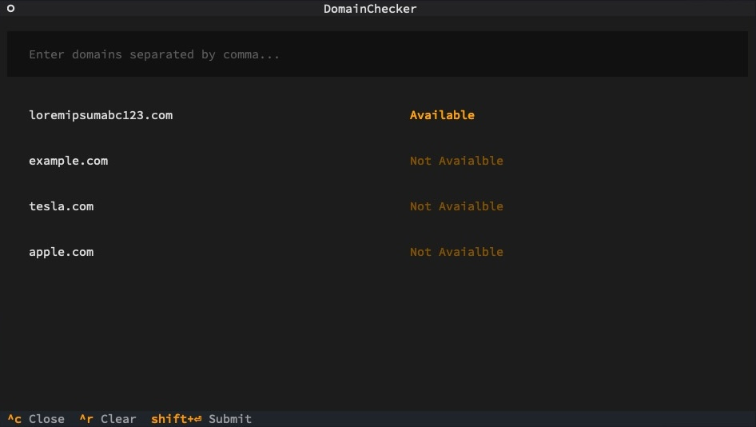

# DomainChecker

Python app that lets you check the availability of multiple domains at once. It uses the Textual library for a user-friendly text-based interface and the Rich library to display results in a nice table format. Just type in a list of domains separated by commas, and the app will show you the status of each one. It ensures each URL is valid, won't print duplicates, and doesn't rely on external APIs.

## Features

- **Easy Interface**: Simple text-based interface with input fields and scrollable results.
- **Batch Domain Checks**: Enter multiple domains separated by commas to check them all at once.
- **Keyboard Shortcuts**: Handy shortcuts for submitting (`Shift+Enter`), clearing (`Ctrl+R`), and quitting (`Ctrl+Q`).
- **Pretty Output**: Uses the Rich library to show results in a neat table.
- **Valid URL Parsing**: Ensures each URL is valid before checking.
- **No Duplicates**: Checks each domain only once and avoids duplicates.


## Installation

1. Clone the repository:

   ```bash
   git clone https://github.com/iamramizk/domain-checker.git
   ```

2. Create a new virtual environment and activate it:

   ```bash
   python3 -m venv .venv
   source .venv/bin/activate   # for Unix/macOS
   .venv\Scripts\activate      # for Windows
   ```

3. Install dependencies:

   ```bash
   pip install -r requirements.txt
   ```

## Usage
1. Run the application:

   ```bash
   python3 app.py
   ```

2. Type in domains separated by commas in the input field.

3. Press `Shift+Enter` to check the availability of the domains.

4. See the results in the scrollable area.

5. Use `Ctrl+R` to clear everything and start over.

6. Press `Ctrl+C` to close/quit the app.


## Shortcuts

- **Submit**: `Shift+Enter`
- **Clear**: `Ctrl+R`
- **Quit**: `Ctrl+C`


## Screenshots



